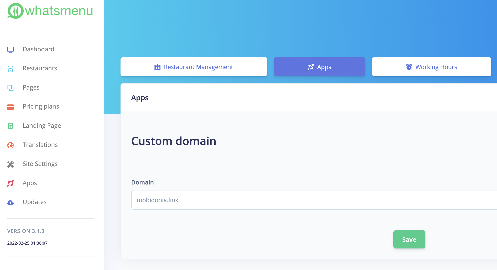

# Custom Domain

In this guide, we will learn how to set up a custom domain, so it points directly to a vendor menu.&#x20;

First, vendors need to enter the domain in their "Apps" section

## Shared Hosting - Creating Addon Domain&#x20;



